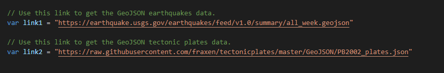
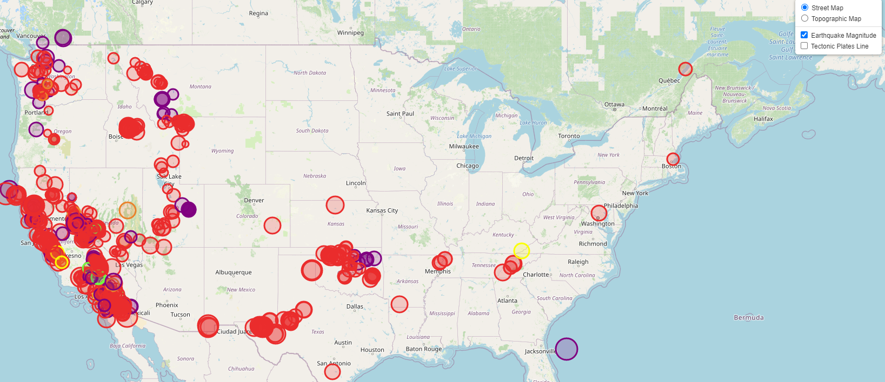
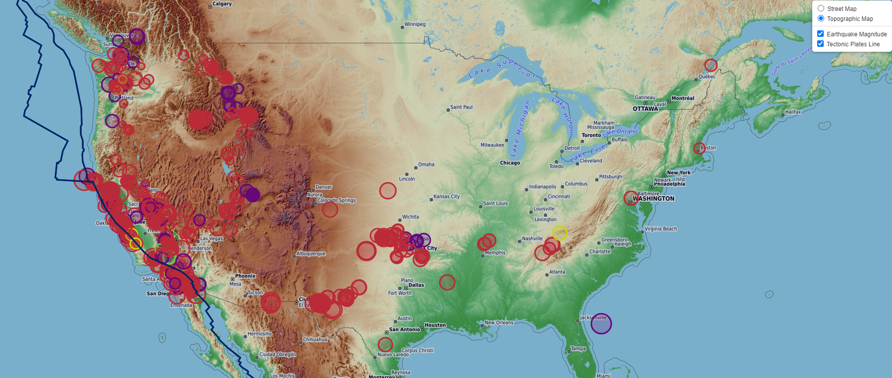
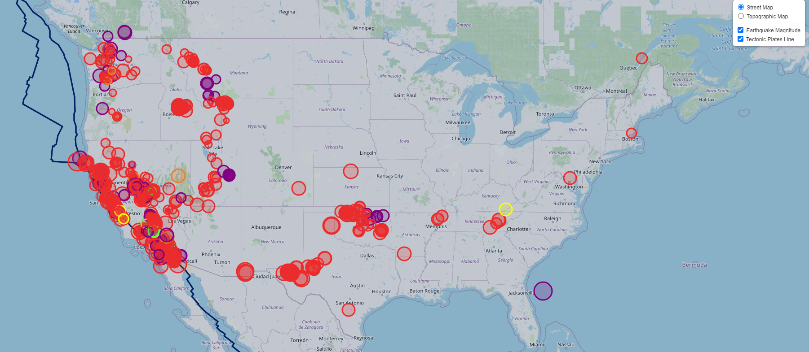
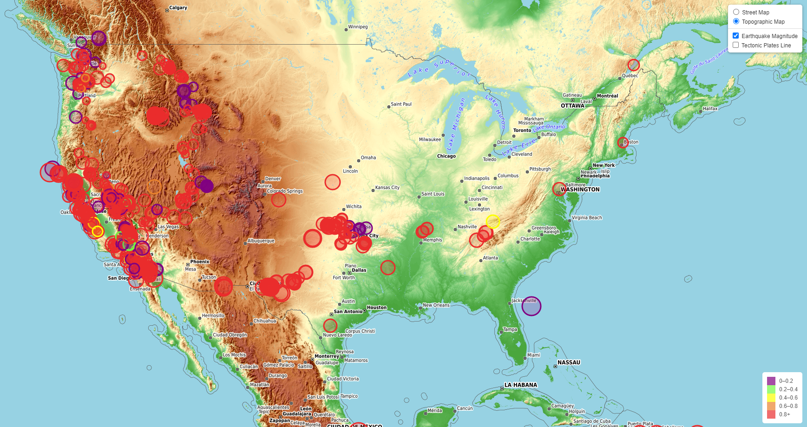

# leaflet-challenge:
--- 
## Fetching Datasets:

Initially the earthquake and tectonic plates datasets are fetched from the USGS GeoJSON feed.

## Import & Visualize the Data:

- A Javascript d3 library is used to parse the JSON data.

- A leaflet map is plotted, based on the longitude and latitude from the earthquakes dataset.

- Here the depth of the earthquake is shown from the third coordinate for each earthquake dataset.

- The popups are added that provides the additional information about the earthquake's magnitude, when a marker is clicked.

- Two base layers, 'street' and 'topo' are created.

- Two overlay maps, 'earthquakes' and 'tectonicPlates' are created.

- A legend provides the context for the map data.

- A layer controls is added to the map.

